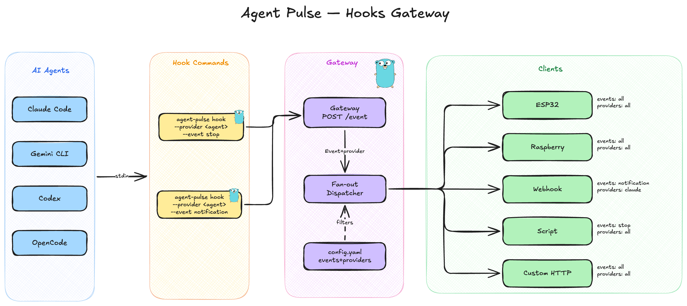

<p align="center">
  
</p>

<h1 align="center">agent-pulse</h1>

<p align="center">
  <strong>A local event gateway for AI code agents.</strong><br/>
  Capture lifecycle events from Claude Code, Gemini CLI, and more — fan them out to any HTTP endpoint, webhook, or device.
</p>

<p align="center">
  <a href="#installation">Install</a> •
  <a href="#quickstart">Quickstart</a> •
  <a href="#agent-setup">Agent Setup</a> •
  <a href="#configuration">Config</a> •
  <a href="#commands">Commands</a>
</p>

---

## Why agent-pulse?

Every AI code agent has its own hook system — different formats, different configs, scattered across projects. Adding a new webhook means editing every project's settings for every agent you use.

**agent-pulse** solves this with a single global config:

- **One config, all agents** — Define your clients once in `~/.config/agent-pulse/config.yaml`. Every project, every agent, every event routed through one place.
- **Zero per-project setup** — No more duplicating hook configs across repositories. Register your hooks once and you're done.
- **Fan-out to anything** — HTTP endpoints, webhooks, IoT devices (ESP32, Raspberry Pi, etc.), scripts — if it speaks HTTP, agent-pulse can reach it.
- **Fully local** — Everything runs on your machine. No cloud, no accounts, no data leaves your network.
- **Filter what matters** — Route specific events to specific clients. Send `notification` events to your desk light, `session_start` to your dashboard, everything to your logger.

---

## Diagram


<p align="center">
  
</p>

---

## Features

- **Event bridge** — Local HTTP gateway that receives agent lifecycle events and dispatches them to registered clients
- **Multi-provider** — Support for Claude Code and Gemini CLI (Codex CLI and OpenCode on the roadmap)
- **Client routing** — Per-client filtering by event type and provider
- **Interactive wizard** — `client add` walks you through registration step by step
- **Custom headers** — Attach headers to client requests with environment variable interpolation (`${API_TOKEN}`)
- **Auto-start** — The gateway starts automatically when a hook fires — no need to manually run the server
- **Parallel dispatch** — Events fan out to all matching clients concurrently
- **Config hot-reload** — Add or remove clients without restarting the server
- **Single binary** — Zero runtime dependencies, just one Go binary

---

## Installation

### From source

Requires [Go 1.25+](https://go.dev/dl/):

```bash
go install github.com/SantiagoBobrik/agent-pulse@latest
```

Make sure `$GOPATH/bin` (or `$HOME/go/bin`) is in your PATH:

```bash
# Add to your ~/.bashrc or ~/.zshrc
export PATH="$PATH:$(go env GOPATH)/bin"
```

### Homebrew

```bash
brew tap SantiagoBobrik/tap
brew install agent-pulse
```

---

## Quickstart

```bash
# 1. Register a client
agent-pulse client add

# 2. Configure hooks in your agent (see Agent Setup below)

# 3. Work normally — the gateway auto-starts when the first event fires
```

---

## Agent Setup

### Claude Code

Add hooks to your Claude Code settings file at `~/.claude/settings.json`. The pattern is the same for every event — here are two examples:

```json
{
  "hooks": {
    "Stop": [
      {
        "hooks": [
          {
            "command": "agent-pulse hook --provider claude --event stop",
            "type": "command"
          }
        ]
      }
    ],
    "Notification": [
      {
        "hooks": [
          {
            "command": "agent-pulse hook --provider claude --event notification",
            "type": "command"
          }
        ]
      }
    ]
  }
}
```

Add as many events as you need by following the same structure. agent-pulse supports all hook events that Claude Code provides — check the [Claude Code Hooks documentation](https://code.claude.com/docs/en/hooks) for the full list of available hook points.

You can configure hooks at the **user level** (`~/.claude/settings.json`) to apply globally, or at the **project level** (`.claude/settings.json`) for per-repo hooks.

### Gemini CLI

> **Note:** Gemini CLI support is untested and under review. The hook interface may change.

Gemini CLI uses the same stdin/stdout JSON protocol as Claude Code. Add hooks to `~/.gemini/settings.json`:

```json
{
  "hooks": {
    "SessionStart": [
      {
        "hooks": [
          {
            "command": "agent-pulse hook --provider gemini --event session_start",
            "type": "command"
          }
        ]
      }
    ],
    "Notification": [
      {
        "hooks": [
          {
            "command": "agent-pulse hook --provider gemini --event notification",
            "type": "command"
          }
        ]
      }
    ]
  }
}
```

Add as many events as you need following the same pattern. See the [Gemini CLI Hooks documentation](https://geminicli.com/docs/hooks/) for all available hook events.

### Other Providers

Support for **Codex CLI** and **OpenCode** is on the roadmap. Codex CLI hooks are [currently under development](https://github.com/openai/codex/issues/2109) by the Codex team.

---

## Configuration

agent-pulse uses a single YAML file at `~/.config/agent-pulse/config.yaml`. This is the only file you need to manage.

### Config anatomy

```yaml
# Server settings
port: 8789                    # Gateway listen port (1024-65535)
bind_address: "127.0.0.1"    # IP address to bind to
gateway_url: "http://localhost" # Base URL for the gateway

# Registered clients
clients:
  - name: "my-webhook"       # Unique client identifier
    url: "https://example.com/hook"  # Destination endpoint
    timeout: 5000             # Delivery timeout in milliseconds
    events:                   # Event filter (omit for all events)
      - stop
      - notification
    providers:                # Provider filter (omit for all providers)
      - claude
    headers:                  # Custom HTTP headers
      Authorization: "Bearer ${WEBHOOK_TOKEN}"
      X-Source: "agent-pulse"
```

### Reference

| Key | Type | Default | Description |
|-----|------|---------|-------------|
| `port` | int | `8789` | Server listen port. Must be between 1024 and 65535. |
| `bind_address` | string | `"127.0.0.1"` | IP address the server binds to. |
| `gateway_url` | string | `"http://localhost"` | Base URL used by the hook command to reach the gateway. |
| `clients` | array | `[]` | List of registered event clients (see below). |

### Client object

| Key | Type | Default | Description |
|-----|------|---------|-------------|
| `name` | string | *required* | Unique identifier for the client. Alphanumeric, hyphens, and underscores only. |
| `url` | string | *required* | HTTP endpoint to deliver events to. Auto-prefixed with `http://` if no scheme is provided. |
| `timeout` | int | `2000` | Request timeout in milliseconds. Valid range: 0–30000. |
| `events` | array | `[]` | Event types this client receives. Empty means **all events**. |
| `providers` | array | `[]` | Providers this client receives events from. Empty means **all providers**. |
| `headers` | map | `{}` | Custom HTTP headers sent with each request. Values support env var interpolation with `${VAR_NAME}` syntax. |

### Providers

| Provider | Status |
|----------|--------|
| `claude` | Supported |
| `gemini` | Supported (hooks in testing) |

### Example: multi-client setup

```yaml
port: 8789
bind_address: "127.0.0.1"
gateway_url: "http://localhost"

clients:
  # ESP32 on local network — lights up on agent activity
  - name: "desk-light"
    url: "http://192.168.1.42"
    timeout: 2000
    events:
      - notification
      - stop

  # Send all events to a logging service
  - name: "logger"
    url: "https://logs.example.com/ingest"
    timeout: 3000
    headers:
      Authorization: "Bearer ${LOG_API_KEY}"

  # Claude-only events to a dashboard
  - name: "claude-dashboard"
    url: "http://localhost:3000/api/events"
    timeout: 5000
    providers:
      - claude
```

---

## Commands

### `agent-pulse server start`

Start the event bridge gateway.

```bash
agent-pulse server start          # Use port from config (default: 8789)
agent-pulse server start -p 9000  # Override port
```

The server writes its PID to `~/.config/agent-pulse/server.pid` and logs to `~/.config/agent-pulse/server.log`. It handles `SIGINT`/`SIGTERM` for graceful shutdown.

---

### `agent-pulse server down`

Stop the running gateway server.

```bash
agent-pulse server down
```

Sends `SIGTERM` to the server process and removes the PID file.

---

### `agent-pulse server logs`

View server logs.

```bash
agent-pulse server logs       # Show last 50 lines
agent-pulse server logs -f    # Follow log output in real time
```

---

### `agent-pulse client add`

Register a new event client. Runs an interactive wizard if no flags are provided.

```bash
# Interactive wizard
agent-pulse client add

# Non-interactive
agent-pulse client add \
  --name my-webhook \
  --url https://example.com/hook \
  --port 443 \
  --timeout 5000 \
  --events stop,notification
```

| Flag | Description |
|------|-------------|
| `--name` | Client name |
| `--url` | Client URL or IP address |
| `--port` | Port number (default: 80) |
| `--timeout` | Delivery timeout in ms (default: 2000) |
| `--events` | Comma-separated event types, or `"all"` |

---

### `agent-pulse client list`

List all registered clients and their configuration.

```bash
agent-pulse client list
```

```
NAME              URL                              TIMEOUT  EVENTS              PROVIDERS
logger            https://logs.example.com/ingest  3000     all                 all
desk-light        http://192.168.1.42:80           2000     notification, stop  all
claude-dashboard  http://localhost:3000/api/events  5000     all                 claude
```

---

### `agent-pulse client remove`

Remove a registered client by name.

```bash
agent-pulse client remove desk-light
```

Name lookup is case-insensitive.

---

### `agent-pulse hook`

Called by agent hooks to forward events to the gateway. You typically don't call this directly — it's invoked by the hook configuration in your agent's settings.

```bash
echo '{"message": "done"}' | agent-pulse hook --provider claude --event stop
```

| Flag | Required | Description |
|------|----------|-------------|
| `--provider` | Yes | Agent provider (`claude`, `gemini`) |
| `--event` | Yes | Lifecycle event name (`session_start`, `session_end`, `stop`, `notification`) |

Reads the event payload from **stdin** as JSON. If the gateway is unreachable, it automatically starts the server in the background before dispatching.

---

## Event payload

Events are delivered to clients as JSON via HTTP POST:

```json
{
  "provider": "claude",
  "event": "stop",
  "data": { ... }
}
```

The `data` field contains the raw payload from the agent, passed through without modification.

---

## License

MIT
